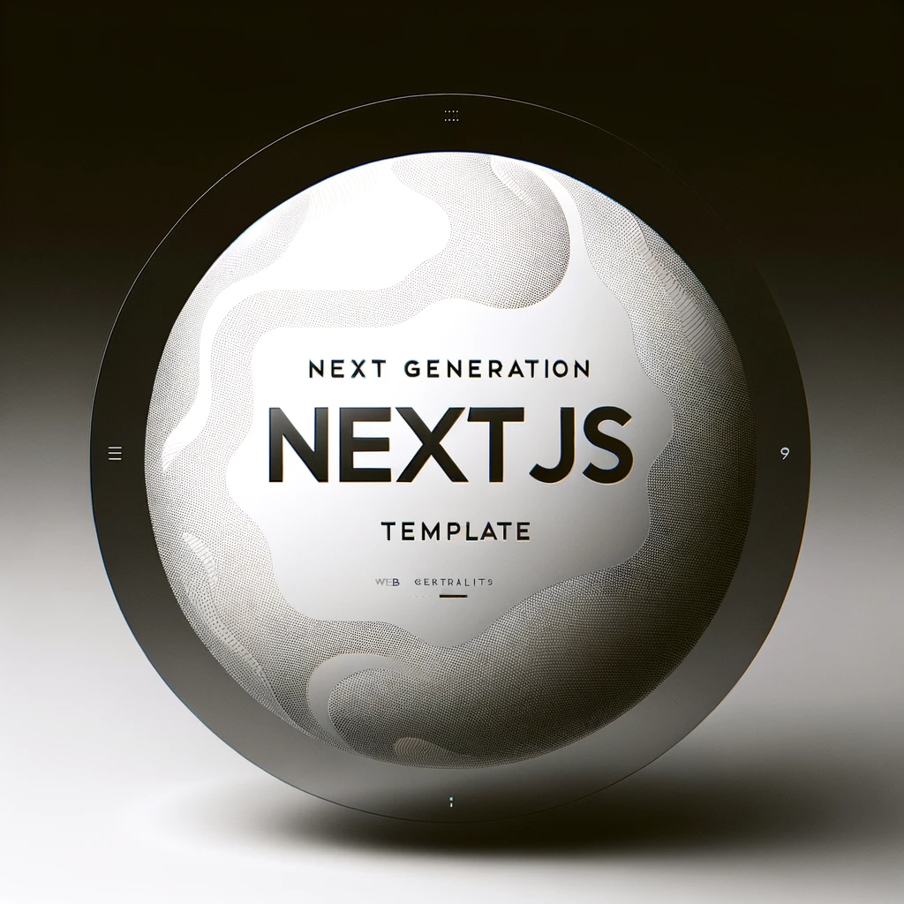

# Let Us Cook

The kickass template for building full stack AI apps with Next.js.



## Project setup

### Step 1

Clone the repository:

```bash
git clone https://github.com/terrytjw/next-gen-template.git
```

### Step 2

Install dependencies:

```bash
bun i
```

### Step 3

Populate env variables in `.env.local` file. See `.env.example` for reference.

```zsh
cp .env.example .env.local
```

### Step 4

Set up your own Supabase postgresDB at https://supabase.com/dashboard/projects

Run the following command to push the schema to the database:

```zsh
bun update-db
```

Schema file can be found in `/lib/db/schema.ts` directory.

### Step 5

Run the development server:

```zsh
bun dev
```

Open [http://localhost:3000](http://localhost:3000) with your browser to see the result.

### Step 6

Run the following command to view the tables:

```zsh
bun studio
```

## Tech stack

1. Next.js (TypeScript) - Fullstack React framework
2. Tailwind CSS (shadcn/ui) - Styling library
3. React Query - Data fetching & Async state management
4. Supabase Auth - Managed Authentication
5. DrizzleORM - ORM
6. Supabase PostgresDB - Database
7. Vercel AI SDK
8. LangChain TS
